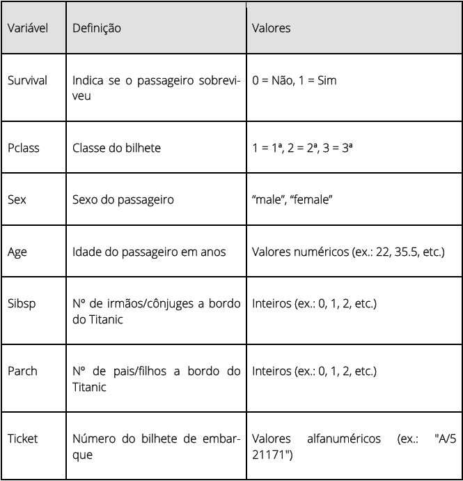
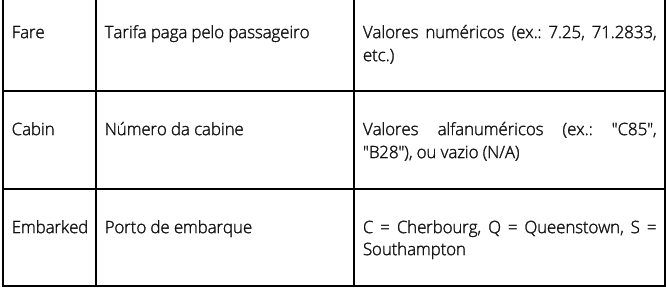
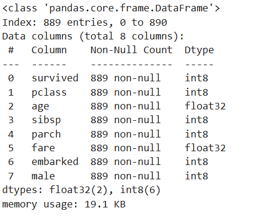
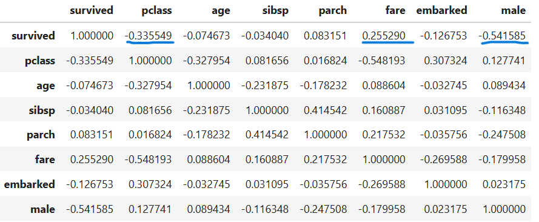
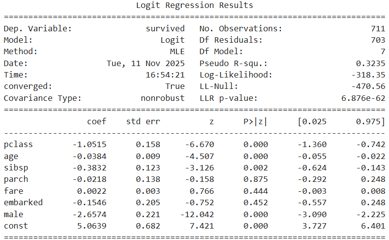
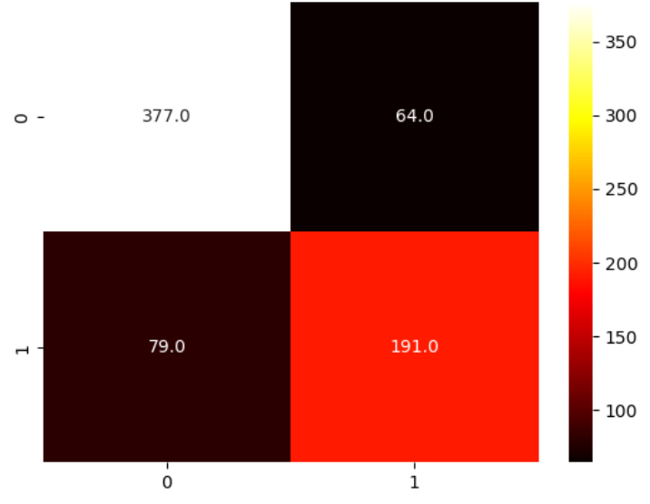
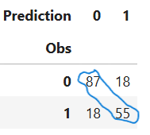

# Previsão da sobrevivência no Titanic

---

Projeto de análise do caso Titanic, que afundou em 1912, resultando numa das maiores tragédias marítimas já registadas. O objetivo será fazer uma previsão da probabilidade de sobrevivência com base nas características dos tripulantes.

### Indíce

---

- [Pré-requisitos](#pré-requisitos)
- [Instalação](#instalação)
    - [Componentes Gerais](#componentes-gerais)
    - [Componentes do ficheiro](#componentes-do-ficheiro)
    - [Execução do Programa](#execução-do-programa)
- [Análise dos dados](#análise-dos-dados)
    - [Informações do dataset](#informações-do-dataset)
    - [Tratamento dos dados](#tratamento-dos-dados)
- [Análise Descritiva de dados](#análise-descritiva-de-dados)
- [Modelo de regressão logística](#modelo-de-regressão-logística)
    - [Definição do modelo](#definição-de-modelo)
    - [Interpretação de resultados](#interpretação-dos-resultados-do-modelo)
    - [Matriz Confusão](#matriz-confusão)
    - [Previsão de resultados](#previsão-de-resultados)
- [Conclusões](#conclusões)
- [Observações finais](#observações-finais)
- [Autor](#autor)
- [Licença](#licença)

### Pré-requisitos
---
* Necessita de ter instalado o **Python 3.12.7** ou superior no sistema operativo.

* Para este caso de estudo as bibliotecas necessárias estão listadas no ficheiro: **[requirements.txt](requirements.txt)**

* Ter o dataset: **[titanic_v2.csv](titanic_v2.csv)**

[:top: índice](#indíce)

### Instalação
---
#### Componentes Gerais
Criar Virtual environment com:

1. Python:
    * Instalar o Python
    Através do [site](https://www.python.org/downloads/?hl=pt):

        1.Clicar no botão 'Download'.

        2.Clique [aqui](https://www.youtube.com/watch?v=8cAEH1i_5s0) e siga as instruções do video.   

    
    <br>
2. Dependências:

    * Instalar as dependências através do terminal:

```
pip instal -r requirements.txt
```

#### Componentes do ficheiro

1. Criar um ficheiro (.ipynb) no Jupyter Notebook.

2. Importar as bibliotecas:
    * numpy
    * pandas
    * seaborn
    * statsmodels.api
    * matplotlib.pyplot

```
import [nome_biblioteca] as [abraviação]
```

3. Carregar o [dataset](titanic_v2.csv).

#### Execução do programa

Para executar este programa é necessário o Jupyter Notebook ou compativel com ficheiros .ipynb.
Correr o programa linha a linha para visualizar os resultados.

[:top: índice](#indíce)

### Análise dos dados
---

#### Informações do dataset

##### Legenda das variáveis




**`df.info()`**


O dataset original tem um formato de 891 linhas por 12 colunas.
Das 12 colunas tem colunas do tipo float64 (2), int64(5), object(5), das quais 9 não apresentam valores nulos.
Não existem entradas duplicadas.

#### Tratamento dos dados

##### Nulos

Após análise dos dados, na coluna 'Age', para tratar os valores nulos optou-se pela média dos dados.

```
df2['age'] = df2['age'].fillna(df2['age'].mean())
```

##### Variáveis categóricas

Nas variáveis categóricas foram consideradas as colunas 'sex' e 'embarked'.

Para a coluna 'sex' foi criada uma nova coluna 'male', com os valores 1 (male) e 0 (female).

```
df2['male'] = df2.apply(lambda x: 1 if x['sex'] == 'male' else 0, axis=1)
```


###### Observação:

>As colunas 'passenger', 'name', 'ticket' e 'cabin' foram desconsideradas para a análise uma vez que eram dados únicos por cada individuo, ao passo a que a coluna 'sex' já fora subtituida por 'male'.

Para a coluna 'embarked' foram atribuidos novos valores, substituindo os anteriores.

```
def local_embarque(local):
    if local == 'C':
        return 1
    elif local == 'S':
        return 2
    else:
        return 3
```

```
df2['embarked'] = df2['embarked'].apply(local_embarque)
```

##### Diminuição do tamanho do ficheiro

Adicionalmente foi reduzido o espaço na memória (19.1 KB), de modo a que a velocidade de processamento aumente,ficando com 2 tipos de dados, float64 nas colunas 'age' e 'fare', int64 nas restantes.



[:top: índice](#indíce)

### Análise Descritiva de dados
---

Sabendo de ante-mão que o que se pretende estudar é a probabilidade de sobrevivência, considera-se desde já que a **variável 'survived' é a variável endógena** (resposta) e as restantes são as variáveis exógenas (causas), sendo portanto a partir daqui toda a análise partindo deste pressuposto.

#### Tabela descritiva


Nesta tabela pode-se observar onde podem existir 'Outliers', onde o desvio-padrão é bastante elevado e onde metade dos dados (25-75%) estão concentrados em intervalos pequenos, como nas colunas 'age', 'sibsp', 'parch' e 'fare'.

###### Observação:
>Não foram eliminados quaiquer dados 'Outliers', uma vez que ao não serem consideradas as linhas onde estão presentes, os restantes dados da entrada podem não ser também eles 'Outliers', excluindo-se linhas que poderiam conter informações importantes nas outras variáveis.

#### Tabela de correlação



###### Observação:

>Através da tabela de correlção pode-se ver que á partida as colunas 'pclass' (-0.335) e 'male' (-0.541) terão uma grande influência negativa sobre a coluna 'survived' (quanto maior os valores destas menor valor de resposta) e em sentido contrário a variável 'fare' (0.255).

[:top: índice](#indíce)

### Modelo de regressão logística

##### Definição de modelo

Para este estudo foi considerada a fórmula de Regressão Logística, onde foram definidas a **variável endógena** ('survived') e as **variáveis exógenas** ('pclass', 'age', 'sibsp', 'parch', 'fare', 'embarked' e 'male').

Foi elaborado o modelo com 80% dos dados do dataframe, escolhidos aleatoriamente.

##### Interpretação dos resultados do modelo



Ao interpretar a tabela resumo, é de destacar os coeficientes da 'pclass' (-1.05), 'sibsp' (-0.38) e 'male' (-2.66) que mais peso têm sobre o modelo, sendo estas estatisticamente significativas em relação á variável resposta (P>|z| < 0.05).

##### Matriz confusão (Avaliação do modelo)



Ao se avaliar os valores trazidos pela matriz confusão, pode-se observar que os verdadeiros positivos (VP) e os verdadeiros negativos (VN) se encontram com uma coloração mais clara, dizendo-nos que o cruzamento entre o que foi previsto e o que realmente aconteceu esteve em concordância, isto é, foram iguais.
Quanto aos Falsos Positivos (FP) e aos Falsos Negativos (FN), com uma coloração escura diz-nos que foram poucos os resultados que não coincidiram com a realidade.

###### Observação
>Após esta análise poderia-se também medir o desempenho do modelo, através da definição de métricas importantes tais como a Exatidão, Precisão, Recuperação, Especificidade ou da Pontuação da f-score.
Estes dados suportam a análise feita.

##### Previsão de resultados

Ao serem inseridos os dados exógenos de teste no modelo, foi definido como resultado 1 todos os valores iguais ou superiores a 0.5, e 0 para todos os resultados abaixo de 0.5.

Para comparar os resultados previstos com as observações feitas para os mesmos dados foi feita a tabela cruzada.



###### Observação

>Ao se analisar a tabela constata-se que do universo total dos dados de teste, cerca de **142 (87 => 0, 55 => 1) são comuns** no conjuto de previsão e no conjuto de observados. Obtendo-se uma taxa de **acerto = 79.78%**, através do cálculo da média da soma dos resultados positivos (observação = previsão) no universo total dos dados de teste.

```
acerto_total = no.mean(y_test == pred_0_1)
```

[:top: índice](#indíce)

### Conclusões
---
1. As variáveis mais fortes, todas elas negativas, do modelo são:
    * Sexo ('male')
    * Classe ('pclass')
    * Nº de irmãos/conjugue a bordo ('sibsp')

2. O modelo construido tem uma elevada fiabilidade (taxa de acerto de ~ 80%).

[:top: índice](#indíce)

### Observações finais

Furutamente, poder-se-á analisar os mesmos dados de formas diferentes com outras considerações tais como: a retirada de entradas 'Outliers', diferentes tratamentos dos dados nulos ou mesmo um diferente ponto limite (superior ou inferior), que neste caso foi de 0.5.

[:top: índice](#indíce)

### Autor
---

Bruno Cardoso
2025
email: bruno.cardoso.professional@gmail.com

[:top: índice](#indíce)

### Licença
---

[:top: índice](#indíce)